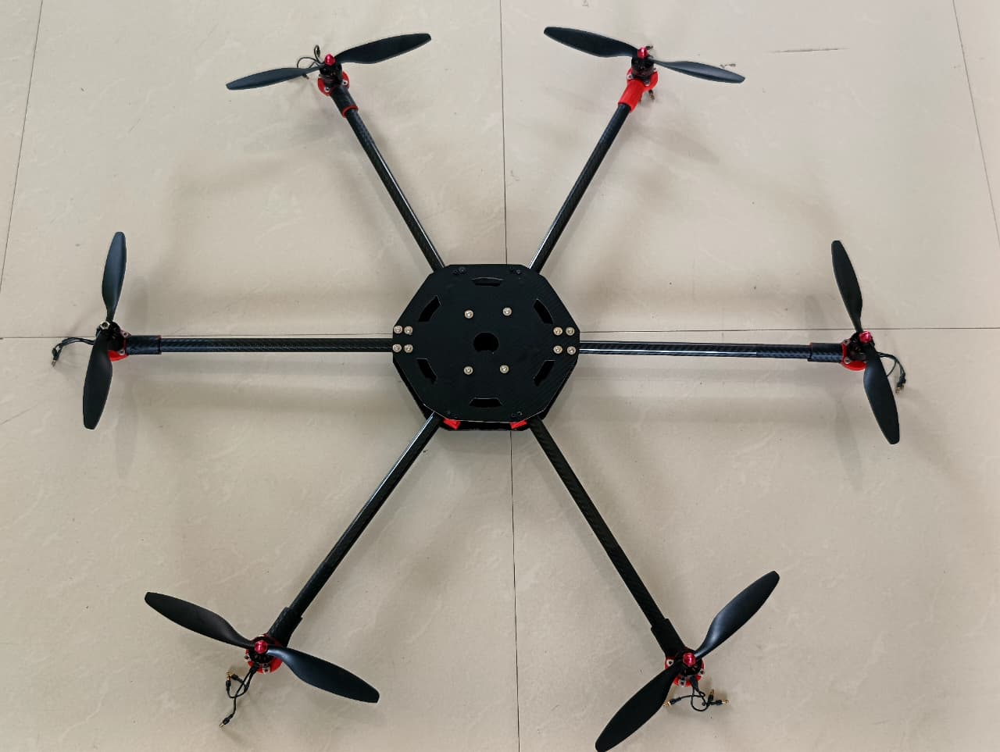
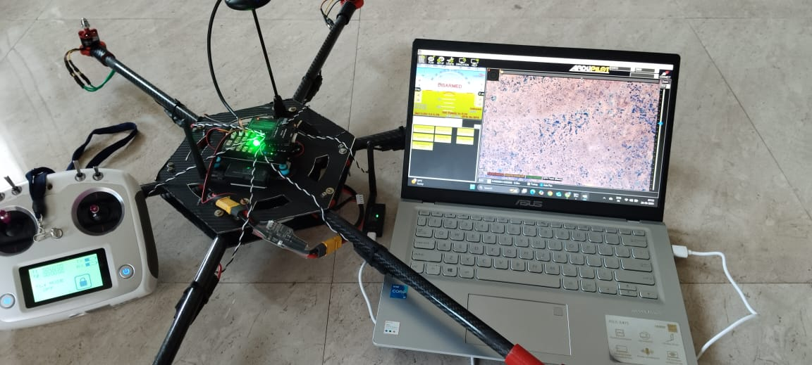
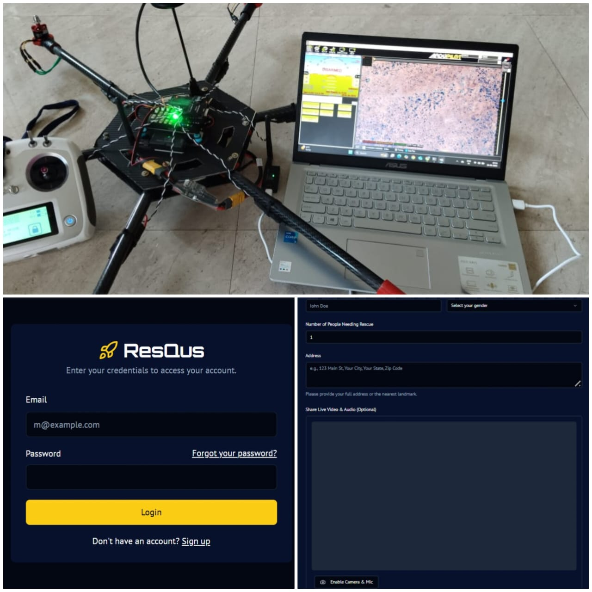

# Dual-Drone  (Scout + Carrier)

Coordinated dual-drone system that integrates with the **NIDAR** app to respond to SOS events.  
- **Scout**: fast VTOL/quad for rapid area scan, visual/thermal search, live map.
- **Carrier**: payload drone for delivery (first aid, radio, power), follows safe route from Scout.

> ⚠️ Research prototype — not certified for critical operations.

## 🎯 Objectives
- 1-tap SOS from NIDAR app → auto mission creation
- Real-time map from Scout (SLAM/thermal) → safe corridor
- Carrier route planning + geofenced drop zone
- Live telemetry to admin panel; audit & mission logs

## 🧱 High-Level Architecture
#

### 🚁 Drone Overview

### 🧩 Detailed Drone Diagram

### 🔗 App Integration

flowchart LR
  A[NIDAR Mobile App\n(SOS + GPS)] --> B[Firebase Cloud\nAuth · Firestore · Functions]
  B --> C[Mission Planner\n(task builder + geofences)]
  C --> D[Scout Drone\nsearch + mapping + thermal]
  D --> E[Map/Detections\n(geoJSON, heat spots)]
  E --> C
  C --> F[Carrier Drone\npayload + drop zone]
  D <-->|MAVLink/ROS2| F
  B --> G[Web Admin Console\nlive map · logs · replay]
  D --> G
  F --> G

sequenceDiagram
  autonumber
  participant User as NIDAR User
  participant App as NIDAR App
  participant FB as Firebase (Firestore/Functions)
  participant MP as Mission Planner
  participant S as Scout Drone
  participant C as Carrier Drone
  participant Admin as Web Admin

  User->>App: Tap SOS (GPS, notes)
  App->>FB: Create Mission doc (NEW)
  FB->>MP: Trigger (onCreate)
  MP->>S: Assign area-scan plan
  S-->>FB: Telemetry + detections (thermal/vision)
  FB->>Admin: Live map update
  MP->>C: Build safe route (geofence from Scout map)
  C-->>FB: Telemetry + drop confirmation (photo)
  FB->>Admin: Status (ENROUTE → DROP → COMPLETE)
  Admin->>FB: Close mission with audit log

## ⚙️ Tech Stack

**Hardware**
- DJI / Custom Drone Frames  
- Pixhawk 6X / Cube Orange+ Flight Controller  
- Jetson Nano / Raspberry Pi 4 (Edge AI Processing)  
- GPS, LiDAR, Ultrasonic & Thermal Sensors  
- ESCs, Propulsion System, Power Distribution Unit  

**Software & Cloud**
- Python, OpenCV, YOLOv8 (Computer Vision)  
- Firebase (Realtime DB, Auth, Cloud Functions)  
- React / Next.js (Admin Dashboard)  
- Android Studio (NIDAR App)  
- MQTT / MAVLink for Drone Communication  
- Flask API for backend coordination  

**AI Modules**
- Object & Victim Detection  
- Path Planning & Obstacle Avoidance  
- Mission Automation Logic  

## 🔮 Future Scope

- Integration of **Swarm Intelligence** for multi-drone coordination.  
- Deploy **Edge AI** on Jetson devices for faster detection and decision-making.  
- Enable **5G connectivity** for ultra-low-latency communication.  
- Use **Blockchain-based mission logging** for secure audit trails.  
- Incorporate **voice-controlled SOS features** in the NIDAR mobile app.  
- Extend payload capacity and hybrid power system for long-range missions.  

