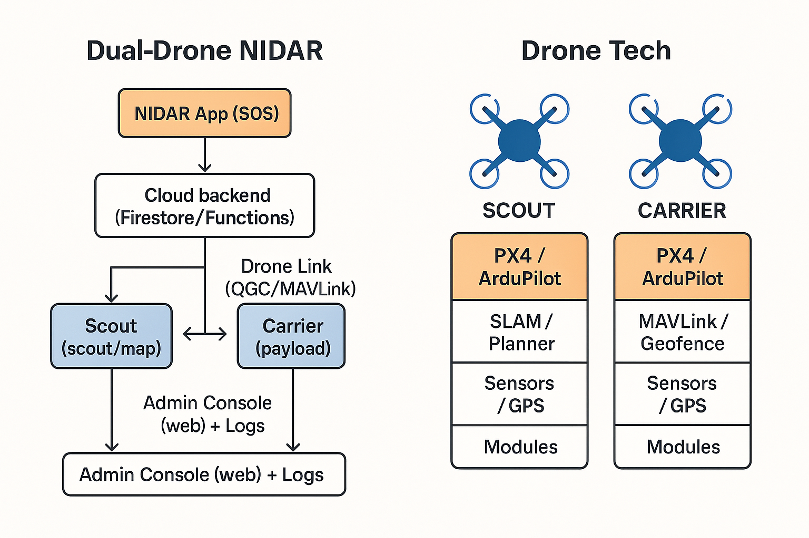

# Dual-Drone  (Scout + Carrier)

Coordinated dual-drone system that integrates with the **NIDAR** app to respond to SOS events.  
- **Scout**: fast VTOL/quad for rapid area scan, visual/thermal search, live map.
- **Carrier**: payload drone for delivery (first aid, radio, power), follows safe route from Scout.

> ⚠️ Research prototype — not certified for critical operations.

## 🎯 Objectives
- 1-tap SOS from NIDAR app → auto mission creation
- Real-time map from Scout (SLAM/thermal) → safe corridor
- Carrier route planning + geofenced drop zone
- Live telemetry to admin panel; audit & mission logs

## 🧱 High-Level Architecture
## 🧠 Architecture Diagram

## 🛰️ Mission Timeline

flowchart LR
  A[NIDAR Mobile App\n(SOS + GPS)] --> B[Firebase Cloud\nAuth · Firestore · Functions]
  B --> C[Mission Planner\n(task builder + geofences)]
  C --> D[Scout Drone\nsearch + mapping + thermal]
  D --> E[Map/Detections\n(geoJSON, heat spots)]
  E --> C
  C --> F[Carrier Drone\npayload + drop zone]
  D <-->|MAVLink/ROS2| F
  B --> G[Web Admin Console\nlive map · logs · replay]
  D --> G
  F --> G

sequenceDiagram
  autonumber
  participant User as NIDAR User
  participant App as NIDAR App
  participant FB as Firebase (Firestore/Functions)
  participant MP as Mission Planner
  participant S as Scout Drone
  participant C as Carrier Drone
  participant Admin as Web Admin

  User->>App: Tap SOS (GPS, notes)
  App->>FB: Create Mission doc (NEW)
  FB->>MP: Trigger (onCreate)
  MP->>S: Assign area-scan plan
  S-->>FB: Telemetry + detections (thermal/vision)
  FB->>Admin: Live map update
  MP->>C: Build safe route (geofence from Scout map)
  C-->>FB: Telemetry + drop confirmation (photo)
  FB->>Admin: Status (ENROUTE → DROP → COMPLETE)
  Admin->>FB: Close mission with audit log

